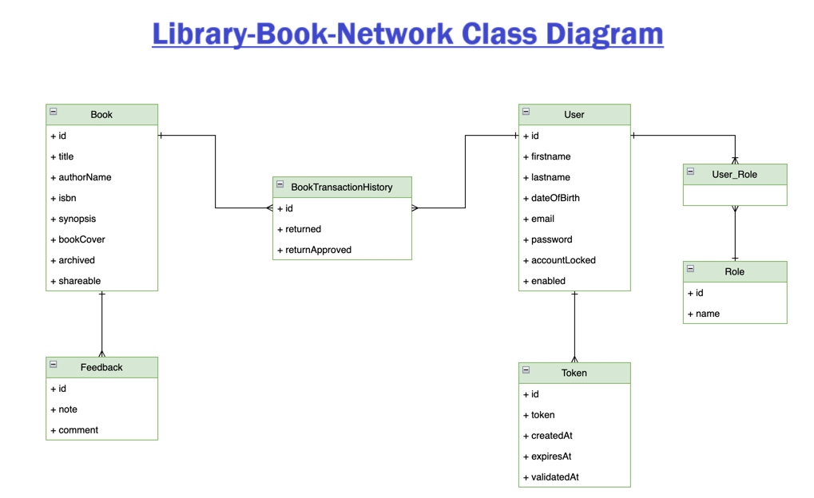
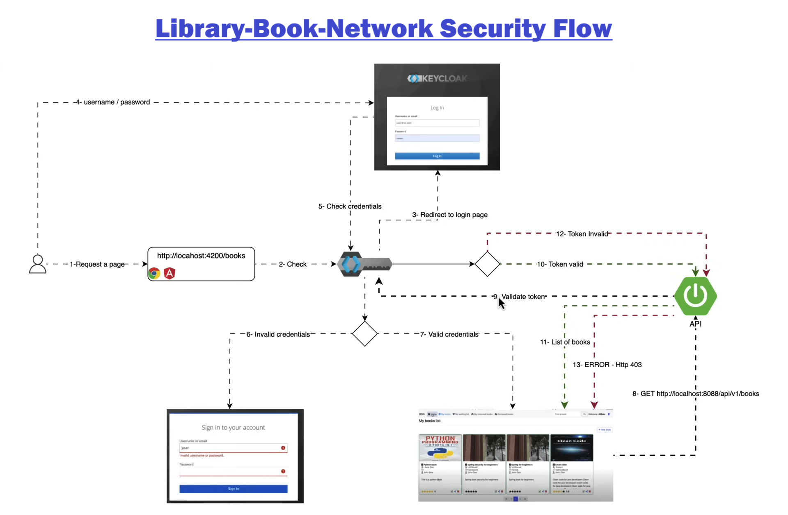

# Library Book Network
Online share your books. Library Book Network is a full-stack application that enables users to manage their
book collections and engage with a community of book enthusiasts. It offers features such as user registration,
secure email validation, book management (including creation, updating, sharing, and archiving), book borrowing
with checks for availability, book return functionality, and approval of book returns. The application ensures
security using JWT tokens and adheres to best practices in REST API design. The backend is built with Spring Boot
3 and Spring Security 6, while the frontend is developed using Angular with Bootstrap for styling.

- This repository holds only frontend code. Lets see how project look alike:


## How to run frontend
- For Local
```
npm i
ng build
npm start
npm run api-gen (to generate open-api doc)
```

- For Production
```
npm i
ng build --configuration production
npm start
```

## Find Swagger ui :
https://library-book-network-backend.onrender.com/api/v1/swagger-ui/index.html (prod)

## Pending task
- Waiting list for borrowing books.
- Search bar.
- Payment option for late fine. Ensure book_owner can set date by which he need book back.
- Book_Owner & Book_Borrower names are not implemented yet.

# library-book-network-keycloak-app in dev

- Migrating my own last project "library-book-network" which had jwt based auth, to integrating it with Keycloak as OAuth2.
- Start your locally-hosted PostgreSQL-Server first and then Keycloak-Server at localhost.
- To run keycloak from CMD#> kc.bat start-dev --http-port 9000
- Go to => http://localhost:9000 and Configure your keycloak settings.
- Then run the springboot backend program from IDE.
- Now you can run Angular with `npm start`
- And hit the browser => http://localhost:4200


## Features
- User Registration: Users can register for a new account.
- Email Validation: Accounts are activated using secure email validation codes.
- User Authentication: Existing users can log in to their accounts securely.
- Book Management: Users can create, update, share, and archive their books.
- Book Borrowing: Implements necessary checks to determine if a book is borrowable.
- Book Returning: Users can return borrowed books.
- Book Return Approval: Functionality to approve book returns.

#### Class diagram


#### Spring security diagram


### Backend (library-book-network-backend)

- Spring Boot 3
- Spring Security 6
- Authentication using Keycloak (OpenID)
- Spring Data JPA
- JSR-303 and Spring Validation
- OpenAPI and Swagger UI Documentation
- Docker

### Frontend (library-book-network-frontend)

- Angular
- Component-Based Architecture
- Lazy Loading
- Authentication Guard
- Keycloak-js
- OpenAPI Generator for Angular
- Bootstrap

## Learning Objectives

By building this project, one can learn:

- Designing a class diagram from business requirements
- Implementing a mono repo approach
- Securing an application using Keycloak with Spring Security
- Registering users and validating accounts via email
- Utilizing inheritance with Spring Data JPA
- Implementing the service layer and handling application exceptions
- Object validation using JSR-303 and Spring Validation
- Handling custom exceptions
- Implementing pagination and REST API best practices
- Using Spring Profiles for environment-specific configurations
- Documenting APIs using OpenAPI and Swagger UI
- Implementing business requirements and handling business exceptions
- Dockerizing the infrastructure in dev

## Live project :
https://library-book-network.vercel.app
